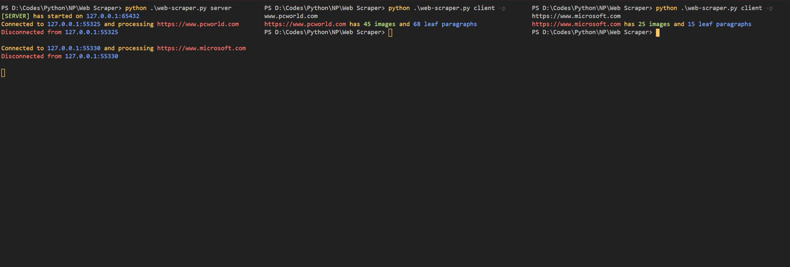

# TCP Web Scraper

TCP web scraping client-server Python based application

## Overall View



## Table Of Contents

1. [About](https://github.com/TrapTheOnly/Test_Service#about-app)
2. [Installation](https://github.com/TrapTheOnly/Test_Service#installation)
3. [Usage Guide](https://github.com/TrapTheOnly/Test_Service#usage-guide)

## About App

- Send a URL link to the website that you wish, and get the amount of images and leaf paragraphs in it. Leaf paragraph is considered such paragraph that has no other child paragraphs in it. For example:

```HTML
<p>
    <a>Text</a>
</p>
```

or

```HTML
<p></p>
```

but not

```HTML
<p>
    <p>Text</p>
</p>
```

or

```HTML
<p>
    <a>
        <p>Text</p>
    </a>
</p>
```

## Installation

In terminal window enter:

```
git clone https://github.com/TrapTheOnly/TCP-Web-Scraper.git
```

To install requirements in terminal window enter:

```C++
pip install -r requirements.txt
```

## Usage Guide

You need at least 2 seperate terminals being open:

Server Terminal

```C++
python web-scraper.py server
```

Client Terminal

```C++
python web-scraper.py client [-p] {URL}
```

Hostname is set to `127.0.0.1`

Port number is set to `65432`

In terminal after entering `client`, `-p` option is necessary. It has to contain URL address of the website you want to process. For example:

```C++
python web-scraper.py client -p www.google.com
```

or

```
python web-scraper.py client -p https://www.google.com
```

To stop server, head to Server Terminal and press `Ctrl+C` in terminal.
